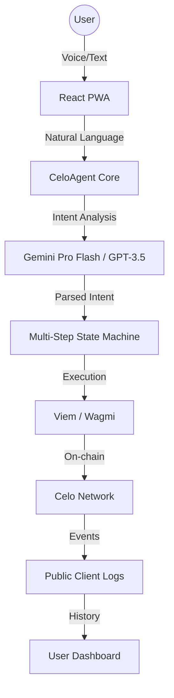

# CRIA: The Intelligent Remittance Agent 🤖💸🌳

**CRIA (Celo Remittance Intent Agent)** is a production-grade, mobile-first financial assistant designed to make global payments as simple as sending a text. By leveraging the Celo network's speed, low fees, and mobile-first infrastructure, CRIA bridges the gap between digital assets and real-world utility for the "next billion" users.

---

## 🌟 Core Value Proposition

CRIA solves the "last mile" problem of remittances by providing a natural language interface for complex blockchain operations.

- **🚀 Instant Out-ramps**: Send funds directly to bank accounts in Nigeria (NGN), Kenya (KES), and Ghana (GHS). CRIA automatically detects account numbers and guides you through the process.
- **💰 Embedded Savings**: Every transaction compares itself against traditional providers (like Western Union), showing users exactly how much they save in real-time.
- **🎙️ Voice-First Banking**: Full integration with the Web Speech API allows for hands-free financial management—just tap the mic and say "Send 5000 Naira to Mom".
- **📖 AgentVault (Memory)**: CRIA remembers your frequent contacts and resolves names like "Sister" or "Dad" to blockchain addresses instantly.

---

## 🛠 Technical Architecture

CRIA is built on a modular, resilient architecture designed for high availability and user safety.



### Key Components:
- **ERC-8004 Registry**: Every agent instance is registered on-chain with a Soulbound Identity, ensuring transparency and discoverability.
- **x402 Economic Model**: A sustainable 0.5% service fee is collected into the CRIA Treasury for every successful transfer, powering the agent's infrastructure.
- **Phonetic Resilience**: Highly tuned parsing for phonetic variations of regional currencies (e.g., "Niara", "Cedi").
- **Invisible Bridging**: Background logic for cross-chain transfers (e.g., Solana to Celo) using standardized bridge interfaces.

---

## 📱 Getting Started (User)

1. **Connect**: Open [CRIA](https://celo-agent-mobile.vercel.app) and connect your Celo-compatible wallet (Valora, MetaMask).
2. **Onboard**: Follow the interactive **Tour Guide** to learn the key features.
3. **Execute**: Try saying "What's the exchange rate for NGN?" or "Send 1 USDC to 0x...".
4. **Save**: After a transfer, CRIA will offer to save the recipient to your "AgentVault" for future use.

## 🛠 Developer Setup

```bash
# Clone and install
git clone https://github.com/cria-finance/mobile
npm install

# Setup environment
cp .env.example .env
# Add VITE_GEMINI_API_KEY

# Run development
npm run dev
```

---

## 🌍 Social Impact
CRIA is built for Celo's mission of **Prosperity for All**. By reducing remittance costs from 7-10% to less than 0.6%, we put more money directly into the hands of families who need it most.

**Celo Hackathon V2 Runner** | *Solving real-world problems, one block at a time.*
