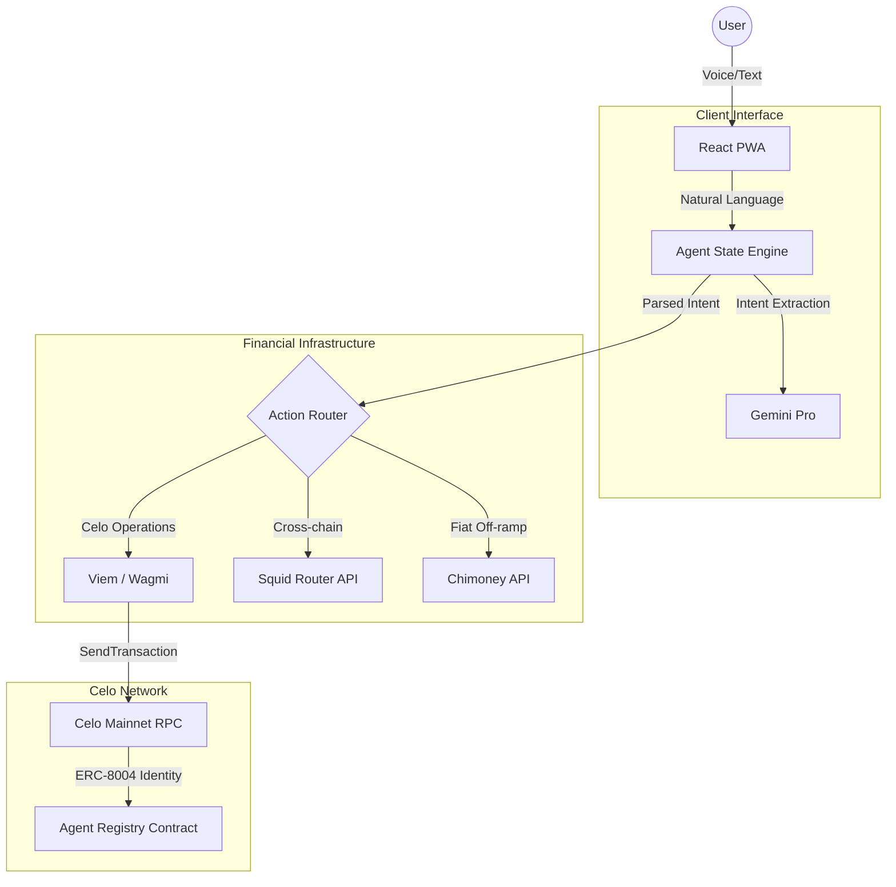

# CRIA: Celo Remittance Intent Agent 🌳

**CRIA (Celo Remittance Intent Agent)** is a production-grade, mobile-first financial assistant designed for the Celo Ecosystem. By leveraging Celo's high-speed, sub-cent fee infrastructure and stacking several partner bounties, CRIA makes global payments as simple as sending a text.

### 🏆 Hackathon Submission
CRIA is submitted to both the **Synthesis Hackathon** and **Celo V2: Build Agents for the Real World**. It integrates several partner tracks:
- **Celo Main Track**: Remittances to NGN, KES, GHS using Celo stablecoins.
- **ENS**: Human-readable agent addresses + discovery.
- **Squid (Uniswap)**: Cross-chain "Invisible Bridging" from Solana/Base.
- **Self Protocol**: ZK-powered identity & reputation via ERC-8004.
- **Filecoin**: Decentralized agent memory/storage via Pinata/IPFS.

---

## 🏗️ Architecture & Core Philosophy

CRIA was architected to synthesize decentralized protocols into a single, cohesive consumer application. We observed that cross-chain DeFi UX is highly fragmented and traditional remittances are prohibitively expensive. CRIA solves this by acting as an intelligent routing layer.

### 1. Deterministic Intent Engine
Unlike generic chatbots that are prone to hallucinations, CRIA utilizes a strict conversational state machine based on the `xState` paradigm. 
- LLMs (Gemini/GPT) are used *strictly* for semantic intent extraction (Amount, Token, Recipient, Chain).
- Once an intent is parsed, the agent isolates the conversational flow to collect rigorous requirements sequentially, ensuring execution safety.

### 2. Embedded Fiat Off-ramps (The "Last Mile")
We convert natural language directly into executable on-chain transactions and real-world fiat settlement.
- **Stablecoin Native**: Operates natively on Celo stablecoins (cUSD, USDC).
- **Direct-to-Bank**: Integrates the Chimoney API for NGN and KES payouts, settling crypto to local fiat instantly.

### 3. Unified Cross-Chain Swaps
DeFi should not be restricted by chain boundaries. CRIA features a powerful 'under-the-hood' cross-chain routing engine.
- **Intelligent Inbound Bridging**: If a user attempts a transfer but lacks Celo liquidity, CRIA detects balances on other EVM/SVM chains (e.g., Solana, Base) and seamlessly bridges capital to Celo using Squid Router or Axelar.
- **Outbound Routing**: CRIA automatically detects non-Celo recipient addresses (Solana Base58, Base EVM) and routes assets outbound across chains efficiently.

### 4. Agent Identity & Infrastructure
- **On-chain Registry (ERC-8004)**: Every CRIA user instance operates with a verified Agent ID. This sybil-resistant identity ensures transparent tracking.
- **AgentVault Decentralized Memory**: Contacts are natively resolved via the **ENS Registry**, giving the agent semantic understanding of addresses. To maintain censorship resistance, user contact states are securely pinned to decentralized peer-to-peer storage (**Filecoin / IPFS**).

---

## ⚙️ Technical Blueprint

CRIA utilizes a multi-layered, resilient architecture separating the semantic AI from the absolute Web3 execution environment.



### Tech Stack & Key Components:
- **Frontend**: React, Vite, TailwindCSS, Framer Motion
- **Web3**: Viem, Wagmi, ConnectKit, @celo/react-celo
- **AI Processing**: Google Gemini Pro & OpenAI GPT-3.5
- **ERC-8004 + Self Protocol**: On-chain Soulbound Agent Identity.
- **ENS Integration**: Name resolution directly in chat.
- **Squid Router (Uniswap)**: Background cross-chain bridging.
- **Filecoin Storage**: Persistent agent memory on IPFS.
- **Infrastructure**: Chimoney Payouts API for fiat settlement.
- **x402 Economic Model**: Sustainable 0.5% service fee for the CRIA Treasury.

---

## 🚀 Local Development

1. **Clone the repository**
```bash
git clone https://github.com/cria-finance/mobile
cd mobile
```

2. **Install dependencies**
```bash
npm install
```

3. **Setup environment variables**
```bash
cp .env.example .env
# VITE_GEMINI_API_KEY (Semantic Engine)
# VITE_CHIMONEY_API_KEY (Fiat Off-ramp)
# VITE_SQUID_INTEGRATOR_ID (Cross-chain Bridging)
```

4. **Run the local development server**
```bash
npm run dev
```

---

## 🛡️ Security & Threat Model (High-Level Audit)

As an agent executing financial operations autonomously, CRIA is heavily hardened against standard Web3 and LLM attack vectors:

1. **Prompt Injection & Execution Hijacking**: The semantic engine (`llm-gemini.ts`) is strictly corralled into returning deterministic JSON schemas. It does not evaluate code. Furthermore, if a malicious prompt successfully alters the recipient address in the JSON payload, the **Wallet Execution Boundary** prevents silent theft. CRIA never holds private keys; it builds unsigned payloads and relies on the user's secure enclave (MetaMask/Valora) for final cryptographic execution.
2. **Infinite Approval Exploits**: The execution engine utilizes explicit `transfer` payloads rather than setting infinite `approve` allowances, ensuring the agent cannot be exploited to drain wallets post-transaction.
3. **Mathematical Precision**: All token amounts are executed using Viem's `parseUnits` and precise contract decimal tracking, eliminating JS floating-point truncation attacks.
4. **Client-Side Key Protection Notice**: *In this frontend-only architectural release, semantic and fiat routing API keys are injected via Vite into the client. For global mainnet commercialization, the `AgentCore` should be detached into a secure serverless backend (e.g., Cloudflare Workers) to protect vendor API credentials from network inspection.*

---

## 🌍 The Endgame

Traditional remittances cost 7-10% and take days to clear. By reducing fees to <1% and settlement times to seconds, while maintaining an approachable, Voice-first interface, we are building the financial infrastructure the world actually needs.  
