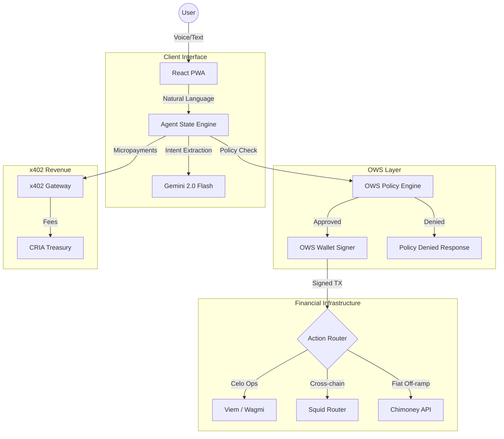

# CRIA Pro — OWS-Powered Remittance Agent 🛡️

**CRIA (Celo Remittance Intent Agent)** is a production-grade, mobile-first financial agent powered by the **Open Wallet Standard (OWS)** for policy-gated signing, **x402** for micropayment revenue, and **ERC-8004** for on-chain agent identity.

### 🏆 OWS Hackathon Submission
**Track: Agent Spend Governance & Identity**

CRIA demonstrates the full OWS stack in a real-world application:
- **OWS Wallet Management**: Policy-gated agent wallet via `createWallet()`, `signTransaction()`
- **OWS Policy Engine**: Declarative spending rules — chain allowlists, spend limits, expiry
- **x402 Micropayments**: CRIA sells AI intent-parsing as pay-per-query services
- **ERC-8004 Identity**: On-chain soulbound agent identity (Agent #2335)
- **Cross-Chain**: Celo, Base, Ethereum, Solana via Squid Router

---

## 🛡️ OWS Integration

### How OWS Powers CRIA

```
User (Voice/Text) → Intent Parser → OWS Policy Gate → OWS Sign → Settle on Celo
```

1. **Policy-Gated Signing**: Every transaction passes through the OWS policy engine before signing. The policy defines allowed chains, spend limits, and expiry.

2. **Agent Wallet**: CRIA's treasury uses an OWS-managed HD wallet (`cria-agent-treasury`) with derived accounts for each supported chain.

3. **API Key Scoping**: External services access CRIA through OWS API keys scoped to specific wallets and policies.

### OWS Policy Example
```json
{
  "id": "cria-remittance-limits",
  "rules": [
    { "type": "allowed_chains", "chain_ids": ["eip155:42220", "eip155:8453", "eip155:1"] },
    { "type": "expires_at", "timestamp": "2027-01-01T00:00:00Z" }
  ],
  "action": "deny"
}
```

---

## 💰 x402 Payment Protocol

CRIA is both a **consumer** and **provider** of x402 micropayment services:

| Service | Price | Description |
|---------|-------|-------------|
| Intent Parse | $0.01 | AI-powered financial intent extraction |
| Balance Check | $0.005 | On-chain balance query across stablecoins |
| Bridge Quote | $0.015 | Cross-chain route discovery via Squid |
| Rate Lookup | $0.002 | Live forex exchange rates |

```bash
# Request without payment → 402 Payment Required
curl https://celo-agent-mobile.vercel.app/api/x402-gateway

# Request with OWS-signed payment → 200 OK
curl -H "Payment-Signature: 0x..." -H "X-Service: intent-parse" \
  https://celo-agent-mobile.vercel.app/api/x402-gateway
```

---

## 🏗️ Architecture



### Tech Stack
- **Wallet**: OWS (Open Wallet Standard) — `@open-wallet-standard/core`
- **Payments**: x402 Protocol — `@x402/core`, `@x402/fetch`  
- **Identity**: ERC-8004 Soulbound Agent Registry
- **Frontend**: React, Vite, TailwindCSS, Framer Motion
- **Web3**: Viem, Wagmi, Reown AppKit
- **AI**: Google Gemini 2.0 Flash, OpenAI GPT-3.5 (failover)
- **Cross-Chain**: Squid Router (Solana, Base, Ethereum → Celo)
- **Fiat**: Chimoney API (NGN, KES, GHS bank payouts)
- **Storage**: Filecoin/IPFS via Pinata

---

## 🚀 Local Development

```bash
git clone https://github.com/southenempire/celo-agent-mobile
cd celo-agent-mobile
npm install
npm run dev
```

### Environment Variables
```env
VITE_GEMINI_API_KEY=     # Gemini 2.0 Flash
VITE_CHIMONEY_API_KEY=   # Fiat off-ramp
VITE_SQUID_INTEGRATOR_ID= # Cross-chain bridging
```

---

## 🛡️ Security

1. **OWS Policy-Gated Signing**: Every transaction validated against OWS policy rules (chain, amount, expiry) before signing.
2. **No Direct Key Access**: Agent never touches private keys — all signing goes through OWS vault.
3. **Anti-Scripting**: 2-second cooldown between actions protects against automated attacks.
4. **Prompt Injection Protection**: LLMs produce deterministic JSON schemas only, never execute code.
5. **Mathematical Precision**: All amounts use `parseUnits` — zero floating-point truncation.

---

## 🌍 Links

- **Live App**: [celo-agent-mobile.vercel.app](https://celo-agent-mobile.vercel.app)
- **Pitch Deck**: [cria-pro-pitch.html](./cria-pro-pitch.html)
- **Agent Registry**: [ERC-8004 #2335 on Celo Mainnet](https://celoscan.io)
- **Demo Video**: [YouTube](https://youtube.com/shorts/tq6bfyvXmZs)

---

Built with 🛡️ OWS · ⚡ x402 · 🌳 Celo · By [southen_](https://github.com/southenempire)
